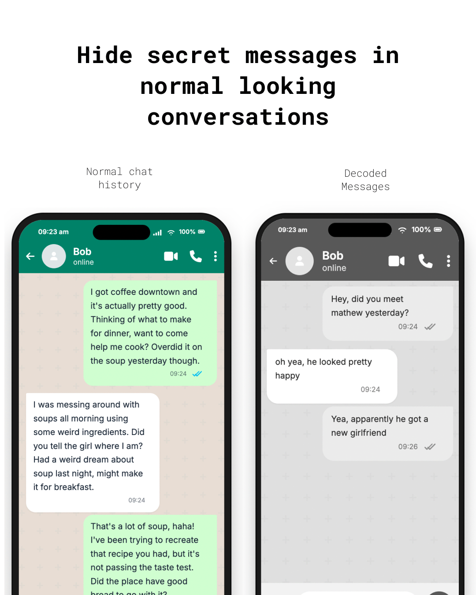

# Conversation Stenography

**Hide secret messages inside normal-looking chat text.**

Conversation Stenography lets two people have a completely private conversation through *any* messaging app (WhatsApp, Telegram, Signal, iMessage, email, or even Instagram DMs). Your secret messages are encrypted and then disguised as innocent, natural-sounding text generated by a local AI model. No one reading the chat can tell there's a hidden message.

## Why Conversation Stenography?

- Governments are moving toward scanning private messages
- Sending normal encrypted messages is risky because it might flag you on basis of suspicioun 

personal note:  I’m 18, and I’m definitely not the first person to explore this idea. LLM-based steganography has existed for years, even GPT-2, the local model used by this project, was released in 2019. People far capable than me have likely been experimenting with techniques like this for a long time. This project simply demonstrates a practical use case for LLMs that may already be operating at scale.

> [!CAUTION]
> **Educational Use Only**
> This project is provided for educational and research purposes. Engaging in any unauthorized or illegal activities is strictly prohibited. The creator assumes no liability for any misuse.

> [!WARNING]
> This is a proof of concept and still has multiple issues. There are several techniques being already developed to figure out if a text has hidden content. 

> **Example:** You type `"meet me at the coffee shop at 3pm"` and Conversation Stenography generates something like `"Hey, I was just thinking about that recipe you mentioned. It sounds amazing, especially the part about the fresh basil."` which is what gets sent in your chat app. Your friend's Conversation Stenography decodes it back to `"meet me at the coffee shop at 3pm"`.




**Your actual messages never leave your device unencrypted.** The messaging platform only ever sees innocent cover text.


## Quick Start

### 1. Install

```sh
# Clone and build
git clone https://github.com/nethical/conversation-stenography.git
cd conversation-stenography
go build -o conversation-stenography ./cmd/conversation-stenography
```

### 2. First run — setup wizard

```sh
./conversation-stenography
```

On first run, Conversation Stenography walks you through everything:
- Lets you pick an AI model (with recommendations for your system)
- Downloads the model automatically
- Creates your config file

That's it. You're ready to chat.

### Test with two users on one device

You do not need two computers or phones to verify that Conversation Stenography works. After
setup, start a local two-person simulation:

```sh
./conversation-stenography simulate
```

Enter your shared secret phrase when prompted. The terminal starts as Alice:

```text
Alice> Meet me outside at six.
  Generating and transporting cover text...

  Cover text (what the messaging app would see):
  <innocent-looking generated message>

  Bob decoded: Meet me outside at six.

Bob> That works for me.
```

Each turn uses two independent protocol participants. One generates the cover
text and the other decodes it, then the prompt automatically switches users.
This exercises the same encryption, model encoding, decoding, and conversation
chain used between separate devices.

Simulation commands:

| Command | What it does |
|---|---|
| `/switch` | Switch the active user without sending |
| `/show` | Show the simulated plaintext conversation |
| `/help` | Show simulation help |
| `/quit` | Exit; simulation state is not saved |

Names and the test conversation can be customized:

```sh
./conversation-stenography simulate -user-a Alex -user-b Samir -conversation test-chat

# Skip the phrase prompt for local testing:
./conversation-stenography simulate -dev-secret
# Or pass an explicit phrase:
./conversation-stenography simulate -secret 'my test phrase'
```

### 3. Start chatting

```sh
./conversation-stenography
```

The tool prompts you for a conversation name and your name, then drops you into the chat:

```
  ┌─────────────────────────────────────┐
  │        🔒  Secure Chat Active       │
  └─────────────────────────────────────┘

  Conversation:  coffee-plans
  You are:       alex

  HOW TO USE:
  • Type a message and press Enter → generates cover text to copy
  • /paste SENDER → paste a message you received from someone
  • /help → see all commands
  • /quit → save and exit

alex>
```

### 4. Send a message

Just type your secret message:

```
alex> Hey, can we meet tomorrow at noon?
  ⏳ Generating cover text...

  ┌─── COPY into your messaging app ───┐

  I was thinking about trying that new place downtown.
  Have you been there before? I heard they have great pasta.

  └─── END — send as alex ───────────────┘
```

Copy into WhatsApp/Telegram/Signal. Longer secrets may show as several paragraphs; send each paragraph as its own chat bubble, in order.

### 5. Receive a message

When your friend sends you a response through the messaging app:

```
alex> /paste bob
  Paste the exact message received from bob below.
  Then type /end on a new line when done:

Yeah the pasta place sounds great! My friend went last week
and said the carbonara was incredible.
/end

  📩 Message from bob:
  Sure, noon works! See you there.
```

If a logical message spans multiple covers, `/paste` one cover at a time in order. Incomplete assemblies print `Waiting for part 2/3 (sync …)` until the last cover arrives. `/status` shows any pending assembly.

## How It Works (for the curious)

```
Your secret message
        ↓
   [AES encryption]
        ↓
   [AI model generates innocent text
    that encodes the encrypted bytes
    in its token choices]
        ↓
Normal-looking chat text  →  WhatsApp/Telegram/Signal  →  Friend's Conversation Stenography
        ↓                                                       ↓
   [AI model recovers                                   [Same process
    the encrypted bytes                                  in reverse]
    from token choices]                                        ↓
        ↓                                              Your secret message
   [AES decryption]
        ↓
  Original message
```

**Key security properties:**
- **AES-SIV encryption** — military-grade authenticated encryption
- **Conversation chain** — every message is cryptographically linked to the previous one; tampering, deletion, or reordering is detected
- **Local AI model** — the model runs entirely on your device, nothing is sent to the cloud
- **Shared secret phrase** — derived using PBKDF2 with 600,000 rounds; never stored on disk

## Setup for Two People

Both people need the **exact same** configuration:

1. **Meet in person** and agree on:
   - A **secret phrase** (6+ random words, e.g. `"purple elephant dances under crimson moonlight"`)
   - A **conversation name** (e.g. `"coffee-plans"`)
   - The **same model** (e.g. both pick option 1 in the setup wizard)

2. **Each person runs:**
   ```sh
   ./conversation-stenography
   # Enter the same conversation name
   # Enter your own name
   # Enter the shared secret phrase when prompted
   ```

3. **Exchange messages** through any messaging app — just copy/paste the cover text.

> [!IMPORTANT]
> Both people must process covers **in the exact same order** they appear in the messaging app, including every cover of a multi-cover send. If you miss a cover, use `/paste` to process it before sending your next reply.

## Commands

| Command | What it does |
|---|---|
| `./conversation-stenography` | Start chatting (or first-run setup) |
| `./conversation-stenography setup` | Re-run the setup wizard |
| `./conversation-stenography simulate` | Test two independent users on one device |
| `./conversation-stenography conversations` | List your saved conversations |
| `./conversation-stenography chat -conversation NAME -me NAME` | Start with explicit flags |

### In-chat commands

| Command | What it does |
|---|---|
| _(just type)_ | Send an encrypted message (may emit multiple covers) |
| `/paste NAME` | Decode one received cover from NAME (repeat in order) |
| `/send` | Multi-line message (end with `/end`) |
| `/show` | Show conversation history |
| `/status` | Show sync info and any pending multi-cover assembly |
| `/help` | List all commands |
| `/quit` | Save and exit |

## Supported Models

The setup wizard offers these models:

| Model | Size | Runtime | Best for |
|---|---|---|---|
| **Llama 3.2 3B (4-bit)** | ~2 GB | MLX | Apple Silicon Macs (recommended) |
| **Llama 3.2 1B (4-bit)** | ~1 GB | MLX | Apple Silicon (lightweight) |
| **Llama 3.1 8B (4-bit)** | ~5 GB | MLX | Apple Silicon (best quality) |
| **GPT-2** | ~500 MB | Transformers | Any system |
| **GPT-2 Medium** | ~1.5 GB | Transformers | Any system (better quality) |

### Prerequisites

- **Go 1.22+** (to build)
- **Python 3.9+**

The setup wizard creates an isolated virtual environment when necessary and
installs `mlx-lm` (Apple Silicon) or `torch + transformers` (other systems),
plus `huggingface-hub`. You do not need to install the `hf` command separately.

## Environment Variables

For automation and scripting:

| Variable | Purpose |
|---|---|
| `CONVERSATION_STENOGRAPHY_SECRET` | Shared phrase (alternative to interactive prompt) |
| `CONVERSATION_STENOGRAPHY_KEY` | Base64 key (legacy, prefer `CONVERSATION_STENOGRAPHY_SECRET`) |
| `CONVERSATION_STENOGRAPHY_CONFIG` | Path to config file (default: `conversation-stenography.local.json`) |
| `CONVERSATION_STENOGRAPHY_MODEL` | Override model path |
| `CONVERSATION_STENOGRAPHY_PYTHON` | Override Python path |
| `CONVERSATION_STENOGRAPHY_RUNTIME` | Override runtime (`mlx` or `transformers`) |

Runtime configuration is machine-specific and is intentionally not committed.
Run `conversation-stenography setup` to generate
`conversation-stenography.local.json`, or copy
`conversation-stenography.example.json` and adjust it for your environment.
Never commit local model paths, interpreter paths, or credentials.

Existing installations can continue using `decalgo.local.json`,
`~/.decalgo/conversations`, and `DECALGO_*` variables while migrating. New
files and documentation use the Conversation Stenography names.

## Advanced: Scripted Usage

For shell automation (e.g. bots, CI, automated relays):

```sh
export CONVERSATION_STENOGRAPHY_SECRET='purple elephant dances under crimson moonlight'
./conversation-stenography chat -conversation coffee-plans -me alex
```

### Multi-party chains (advanced)

For programmatic multi-party message exchange:

```sh
export CONVERSATION_STENOGRAPHY_KEY="$(openssl rand -base64 32)"

# Bob sends
printf 'hi alex' | ./conversation-stenography chain-send \
  -conversation friends -state bob.state -from bob > record-1.json

# Alex receives
./conversation-stenography chain-receive \
  -conversation friends -state alex.state < record-1.json
```

## Important Notes

- **Messages must be copied exactly.** No autocorrect, no formatting, no smart quotes. Copy and paste the cover text byte-for-byte.
- **Process messages in order.** Both people must paste received messages in the exact order they appear in the messaging app.
- **Same model required.** Both people must use the same AI model, same version, same settings. The setup wizard handles this.
- **The secret phrase is never stored.** You'll need to re-enter it each time you start Conversation Stenography (or set `CONVERSATION_STENOGRAPHY_SECRET`).

## Security Model

- Messages are encrypted with **AES-SIV** (Synthetic Initialization Vector), which provides both confidentiality and integrity.
- Every message is chained — each carrier authenticates the sender, conversation ID, message index, and the hash of all previous messages.
- The shared phrase is stretched with **PBKDF2-HMAC-SHA-256** (600,000 iterations).
- The AI model runs **100% locally**. No API calls, no cloud, no telemetry.
- Conversation state is encrypted at rest with AES-GCM.

## Building from source

```sh
git clone https://github.com/nethical6/conversation-stenography.git
cd conversation-stenography
go build -o conversation-stenography ./cmd/conversation-stenography
go test ./...
```

## License

See [LICENSE](LICENSE) for details.
