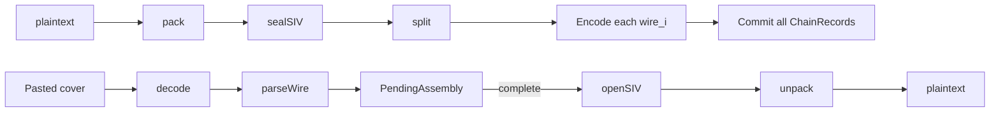

# Large-message capacity implementation plan

> **For agentic workers:** REQUIRED SUB-SKILL: Use `superpowers:subagent-driven-development` (recommended) or `superpowers:executing-plans` to implement task-by-task. Steps use checkbox (`- [ ]`) syntax for tracking.

**Goal:** Auto-chunk sealed payloads across N covers with a denser capacity generative profile so plaintext scales without a fixed size ceiling beyond practical cover length.

**Architecture:** One logical send packs and AES-SIV-seals once under `aad_logical`, splits ciphertext into wire pieces (`part`/`total`/`len` + optional `sealed_len` on part 0), encodes each piece with the capacity profile (`arithmetic`, `top_n: 32`, `length_bias: 0`), and commits chain records only after every cover succeeds. Receive parses wire, buffers pending assembly per `(conversation, from)`, commits each accepted cover, then `openSIV` + unpack when complete. Legacy `Send`/`Receive` stay for old single-carrier AAD; interactive/simulate switch to `SendMessage`/`ReceiveMessage`.

**Tech Stack:** Go library (`conversationstenography`), AES-SIV, GenerativeCodec (arithmetic), CLI in `cmd/conversation-stenography`, fixture `fakeModel` tests.

**Spec:** [docs/superpowers/specs/2026-07-18-large-message-capacity-design.md](docs/superpowers/specs/2026-07-18-large-message-capacity-design.md)

## Global Constraints

- Label style: `decalgo-large-msg-v1` for logical AAD (match existing `decalgo-*` prefixes).
- Capacity defaults: `max_cover_chars=600`, `capacity_top_n=32`, `capacity_length_bias=0`, `coding=arithmetic`, `candidate_pool=max(8, capacity_top_n)`.
- Raise `CandidatePool` max from 16 to 64 in [`generative.go`](generative.go) so capacity profile `CandidatePool=32` is valid.
- All-or-nothing send: buffer covers, commit only when every chunk encodes.
- One code path for short/long: `t==1` is the short case via `SendMessage`/`ReceiveMessage`.
- Pending assembly encrypted at rest with chain state (same AES-GCM envelope).
- No Meteor/ANS, no SIV tag shortening, no cloud/GUI transport changes.

## Locked design decisions

**Logical AAD** (seal once for the whole message; trial/mode bound once, not per chunk):

```
"decalgo-large-msg-v1\x00" || conversation || 0 || from || 0 ||
chainHashBefore[32] || senderSeqBefore(uint64 BE) ||
0,'t','r','i','a','l',byte(trial)  // omitted when trial==0
|| 0,'p','a','c','k',mode
```

`chainHashBefore` / `senderSeqBefore` are captured at the start of `SendMessage` / when accepting part 0 on receive, and stored in pending assembly so later parts can still open after the chain has advanced.

**Carrier trials:** Outer loop reseals the full packed plaintext once per trial (same sealed→split→encode-all), then picks the first trial where every chunk passes human/semantic gates. Matches “seal once” per logical attempt without per-chunk SIV tags.

**Legacy receive fallback:** If decoded bytes are not a valid large-msg wire header, `ReceiveMessage` falls through to today’s `Receive` path so old in-flight carriers still work.

**Persistence:** Additive `Pending` field on `persistedChainState` with `omitempty`; keep `chainStateVersion = 2` (no forced state reset).



## File structure

| File | Responsibility |
|------|----------------|
| Create [`message_chunks.go`](message_chunks.go) | Wire encode/decode, split/join sealed blobs, piece sizing helpers |
| Create [`message_chunks_test.go`](message_chunks_test.go) | Split/join + malformed header tests |
| Modify [`conversation_chain.go`](conversation_chain.go) | `SendMessage`, `ReceiveMessage`, `ReceiveStatus`, pending assembly, capacity config, `EncodingBudget` fields, logical AAD |
| Modify [`conversation_chain_test.go`](conversation_chain_test.go) | Multi-chunk, all-or-nothing, persistence-style, density smoke |
| Modify [`generative.go`](generative.go) | Raise `CandidatePool` max to 64 |
| Modify [`cmd/.../config.go`](cmd/conversation-stenography/config.go) | `max_cover_chars`, `capacity_top_n`, `capacity_length_bias` |
| Modify [`cmd/.../chain.go`](cmd/conversation-stenography/chain.go) | Persist/restore pending; wire capacity into chain construction |
| Modify [`cmd/.../interactive.go`](cmd/conversation-stenography/interactive.go) | Multi-cover send UX, waiting paste, `/status` pending |
| Modify [`cmd/.../simulate.go`](cmd/conversation-stenography/simulate.go) | Use `SendMessage`/`ReceiveMessage` |
| Modify [`conversation-stenography.example.json`](conversation-stenography.example.json) | Document new keys |
| Modify [`README.md`](README.md) | Multi-cover paste order note |
| Save plan copy to [`docs/superpowers/plans/2026-07-18-large-message-capacity.md`](docs/superpowers/plans/2026-07-18-large-message-capacity.md) on execution start |

---

### Task 1: Wire format + split/join (no generative)

**Files:** Create `message_chunks.go`, `message_chunks_test.go`

**Produces:**
- `func encodeChunkWire(part, total, sealedLen int, piece []byte) []byte` — part 0 includes `sealedLen`; later parts omit it
- `func decodeChunkWire(wire []byte) (part, total, sealedLen, pieceLen int, piece []byte, err error)` — `sealedLen < 0` means absent
- `func splitSealed(sealed []byte, maxPiece int) [][]byte`
- `func joinSealed(pieces [][]byte) []byte`

- [ ] **Step 1:** Write failing tests for round-trip random sealed blobs; reject swap/drop/reorder/`total` mismatch/truncated piece via join+header checks
- [ ] **Step 2:** Implement uvarint wire using `encoding/binary.PutUvarint` / `Uvarint`
- [ ] **Step 3:** `go test ./... -run 'Test(Split\|Join\|ChunkWire)' -count=1` passes
- [ ] **Step 4:** Commit `feat(chunks): add large-msg wire split/join`

---

### Task 2: Capacity profile + CandidatePool limit

**Files:** Modify `generative.go` (CandidatePool max 64); add capacity helpers on `ConversationChain` in `conversation_chain.go`

**Produces:**
- Fields on chain or config: `MaxCoverChars`, `CapacityTopN`, `CapacityLengthBias` (defaults 600 / 32 / 0)
- `func (c *ConversationChain) capacityConfig() GenerativeConfig` — copy `baseConfig`, force `Coding="arithmetic"`, `TopN=CapacityTopN`, `LengthBias=CapacityLengthBias`, `CandidatePool=max(8, TopN)` when `StrictStyle`
- `func estimateMaxPieceBytes(maxCoverChars, topN int) int` — conservative: assume ≥1 bit/token lower bound using `log2(topN)/4` bits/token and ~4 visible chars/token; subtract ~16 bytes header budget; clamp min piece ≥ 1

- [ ] **Step 1:** Test `NewGenerativeCodec` accepts `CandidatePool: 32`
- [ ] **Step 2:** Raise max to 64; implement `capacityConfig` + piece estimator
- [ ] **Step 3:** Commit `feat(capacity): raise pool max and capacity profile`

---

### Task 3: `SendMessage` / `ReceiveMessage` + pending assembly

**Files:** Modify `conversation_chain.go`, `conversation_chain_test.go`

**Produces:**

```go
type ReceiveStatus struct {
    Waiting      bool
    Part         int
    Total        int
    ReceivedMask string
    SyncCode     string
}

type PendingAssembly struct {
    From           string
    Total          int
    SealedLen      int
    NextPart       int
    Pieces         [][]byte // len Total; nil = missing
    ChainBefore    [32]byte
    SenderSeqBefore uint64
}

func (c *ConversationChain) SendMessage(ctx context.Context, from string, plaintext []byte) ([]ChainRecord, error)
func (c *ConversationChain) ReceiveMessage(ctx context.Context, from, encrypted string) (plaintext []byte, done bool, status ReceiveStatus, err error)
func (c *ConversationChain) PendingAssemblyFor(from string) (PendingAssembly, bool)
func (c *ConversationChain) ExportPending() []PendingAssembly
func (c *ConversationChain) RestorePending(pending []PendingAssembly) error
```

**SendMessage algorithm:**
1. Capture `chainBefore`, `seqBefore := sequences[from]`, `startIndex := len(records)`
2. `mode, packed := packMessageDetached(...)`
3. `maxPiece := estimateMaxPieceBytes(...)`; allow one shrink retry if any cover overshoots `MaxCoverChars`
4. For `trial := 0 .. CarrierTrials-1`:
   - `sealed := sealSIV(key, logicalAAD(...), packed)`
   - `pieces := splitSealed(sealed, maxPiece)`
   - Build `wire_i`, encode each with `capacityConfig()` + `messageConfig` prompt (update prompt transcript with already-buffered covers from this send for later chunks)
   - On full success: commit all records in order; return
5. On failure: leave chain unchanged; return error

**ReceiveMessage algorithm:**
1. Decode carrier (unframed candidates then framed) → `wire`
2. If `decodeChunkWire` fails → fall back to `Receive` (legacy); map to `(plaintext, true, status{}, nil)`
3. Else validate against pending for `from` or start new if `part==0` and none pending; store `ChainBefore`/`SenderSeqBefore` on part 0
4. Commit `ChainRecord` for this cover; update pending
5. When complete: `joinSealed` → try `openSIV` over packing modes × trials with stored logical AAD → unpack → clear pending → `(plaintext, true, status, nil)`
6. Incomplete: `(nil, false, Waiting status, nil)`
7. SIV fail after all parts: clear pending; error “authentication failed / desync”; chain keeps committed covers

- [ ] **Step 1:** Tests: short `t==1` round-trip; ~2KiB multi-chunk with `MaxCoverChars` forced small; skip cover → waiting/error; force last-chunk encode fail → zero commits; restore pending via `ExportPending`/`RestorePending`
- [ ] **Step 2:** Implement APIs
- [ ] **Step 3:** `go test ./... -run 'Test.*Message|Test.*Chunk|Test.*Pending|Test.*AllOrNothing' -count=1`
- [ ] **Step 4:** Commit `feat(chain): add SendMessage and ReceiveMessage`

---

### Task 4: EncodingBudget + density smoke

**Files:** Modify `EncodingBudget` in `conversation_chain.go` + tests

**Produces:** Add `SealedBytes`, `ChunkCount`, `MaxCoverChars` to `EncodingBudget`; when budgeting for SendMessage path, use capacity profile piece estimate (`ChunkCount = ceil(sealed/maxPiece)`, etc.)

- [ ] Soft density assertion: same plaintext/fixture, capacity profile reports fewer chunks or lower estimated total visible chars than `TopN:8` + `LengthBias:0.1`
- [ ] Commit `feat(budget): report sealed bytes and chunk count`

---

### Task 5: Config + CLI persistence + UX + simulate

**Files:** `config.go`, `chain.go`, `interactive.go`, `simulate.go`, example JSON, README

**Config JSON:**
```json
"max_cover_chars": 600,
"capacity_top_n": 32,
"capacity_length_bias": 0
```

**`persistedChainState`:** add `Pending []PendingAssemblyDTO` (base64 pieces) with omitempty; on load after `RestorePublic`, call `RestorePending`.

**CLI:**
- `interactiveSend` → `SendMessage`; print `Cover i/t — copy into your messaging app:` for each; optional budget line after multi-cover send
- `/paste` → `ReceiveMessage`; if `!done`: `Waiting for part X/Y (sync abcd)`; if done: show plaintext
- `/status` → show pending mask if any
- Simulate: send all covers to peer in order via `ReceiveMessage`

- [ ] Update README: paste covers in order; incomplete shows waiting
- [ ] Commit `feat(cli): multi-cover send/paste and pending state`

---

### Task 6: Full verification

- [ ] `go test ./... -count=1`
- [ ] Manual smoke (optional): short message `t==1`; longer message multi-cover; kill mid-paste, reload, finish
- [ ] Commit any doc/fixups: `docs(capacity): note multi-cover paste order`

## Spec coverage checklist

| Spec item | Task |
|-----------|------|
| Wire format part 0 / i>0 | 1 |
| Split/join + reject bad assembly | 1, 3 |
| Capacity profile + denser settings | 2 |
| `SendMessage` / `ReceiveMessage` / `ReceiveStatus` | 3 |
| Logical AAD + single SIV | 3 |
| All-or-nothing send | 3 |
| Pending persistence | 3, 5 |
| EncodingBudget new fields | 4 |
| CLI multi-cover + `/status` + simulate | 5 |
| README note | 5 |
| Density smoke | 4 |
| Tests 1–6 from spec | 1, 3, 4, 5 |

## Risks (from spec, handled in tasks)

- Higher `top_n` naturalness: keep per-chunk human/semantic gates; outer trial reseal.
- Large `t` paste tedium: density + `max_cover_chars` only (no silent merge).
- Pending complexity: library-owned assembly + encrypted CLI state.
